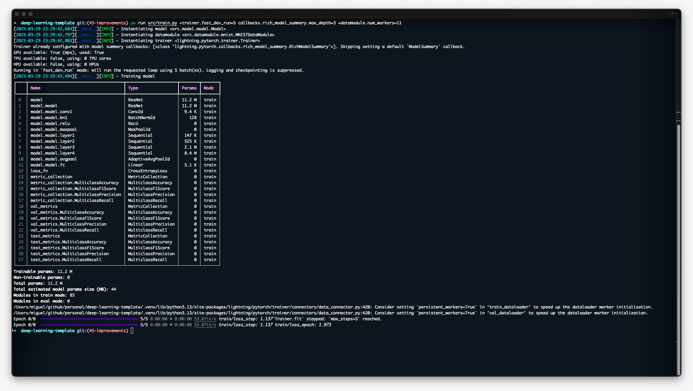

<div align="center">

# Lightning hydra-zen Template
[](https://github.com/pre-commit/pre-commit)
[](https://pytorch.org/get-started/locally/)
[](https://pytorchlightning.ai/)
[](https://hydra.cc/)
[](https://github.com/astral-sh/ruff)
[](https://github.com/astral-sh/uv) <br>
[](https://github.com/miguelbper/lightning-hydra-zen-template/actions/workflows/code-quality.yaml)
[](https://github.com/miguelbper/lightning-hydra-zen-template/actions/workflows/tests.yaml)
[](https://codecov.io/gh/miguelbper/lightning-hydra-zen-template)
[](https://github.com/miguelbper/lightning-hydra-zen-template/blob/main/LICENSE)

A template for deep learning projects using PyTorch Lightning and hydra-zen



</div>

---
<!-- TODO: add better description -->
## Description

A template for deep learning projects, using
- [PyTorch](https://github.com/pytorch/pytorch) - Tensors and neural networks
- [Lightning](https://github.com/Lightning-AI/pytorch-lightning) - Framework for organizing PyTorch code
- [TorchMetrics](https://github.com/Lightning-AI/torchmetrics) - Metrics for Lightning
- [Optuna](https://github.com/optuna/optuna) - Hyperparameter optimization
- [MLflow](https://github.com/mlflow/mlflow) - Experiment tracking
- [Hydra](https://github.com/facebookresearch/hydra) - Configuration files
- [hydra-zen](https://github.com/mit-ll-responsible-ai/hydra-zen) - Wrapper for Hydra
- [Ruff](https://github.com/astral-sh/ruff) - Linting and formatting
- [uv](https://github.com/astral-sh/uv) - Dependency management

## Directory structure
<!-- TODO: update this with tree -->
```
├── .github/                           <- GitHub Actions workflows
│   └── workflows/
│       ├── code-quality.yaml
│       ├── coverage.yaml
│       ├── publish.yaml
│       └── tests.yaml
│
├── data/                              <- Directory for datasets
│   ├── external/                      <- External data sources
│   ├── interim/                       <- Intermediate results of dataset processing
│   ├── processed/                     <- Datasets ready to be used by the modelling scripts
│   └── raw/                           <- Datasets as obtained from the source
│
├── logs/                              <- Training logs, artifacts, metrics, checkpoints, and experiment tracking data
│
├── notebooks/                         <- Jupyter notebooks for experimentation
│
├── scripts/                           <- Shell scripts
│
├── src/                               <- Source code for the project
│   └── lightning_hydra_zen_template/  <- Main package directory
│       ├── configs/                   <- Configuration files for Hydra
│       │   ├── groups/
│       │   │   ├── __init__.py
│       │   │   ├── callbacks.py       <- Callback configurations
│       │   │   ├── data.py            <- Data module configurations
│       │   │   ├── debug.py           <- Debug configurations
│       │   │   ├── experiment.py      <- Experiment configurations
│       │   │   ├── hparams_search.py  <- Hyperparameter search configurations
│       │   │   ├── hydra_conf.py      <- Hydra configuration settings
│       │   │   ├── logger.py          <- Logger configurations
│       │   │   ├── model.py           <- Model configurations
│       │   │   ├── paths.py           <- Path configurations
│       │   │   └── trainer.py         <- Trainer configurations
│       │   │
│       │   ├── utils/                 <- Utility functions for configurations
│       │   ├── __init__.py
│       │   ├── eval.py                <- Main configuration for evaluation
│       │   └── train.py               <- Main configuration for training
│       │
│       ├── data/                      <- LightningDataModules for handling datasets
│       │
│       ├── model/                     <- LightningModules
│       │
│       ├── utils/                     <- Utility functions
│       │
│       ├── __init__.py
│       ├── eval.py                    <- Main testing / evaluation script
│       └── train.py                   <- Main training script
│
├── tests/                             <- Automated tests
│
├── .envrc.example                     <- Example environment variables file (rename to .envrc)
├── .gitignore
├── .pre-commit-config.yaml
├── .python-version                    <- Python version that will be installed
├── img.png
├── justfile                           <- Project commands
├── LICENSE
├── pyproject.toml                     <- Project configuration file with dependencies and tool settings
├── README.md
└── uv.lock                            <- The requirements file for reproducing the environment
```


## Installation

```bash
...
```

## Usage

```python
...
```

## License

This project is licensed under the MIT License - see the [LICENSE](LICENSE) file for details.

## Acknowledgements
This template is heavily inspired by [ashleve/lightning-hydra-template](https://github.com/ashleve/lightning-hydra-template) and it is my personal take on that idea. Another very nice template for data science projects is [drivendataorg/cookiecutter-data-science](https://github.com/drivendataorg/cookiecutter-data-science).

<!-- ###########################################################################
TODOS
- TODO: add HPO callbacks: automatic LearningRate, BatchSize
- TODO: add links to good "best practices" reading/watching material, as well as my own suggestions
- TODO: add checklist on how to approach a new problem
- TODO: add extra suggested libraries (nbautoexport, ...)
- TODO: add what motivated me to do these changes, relative to the repos that already exist
    - Borrow ideas from both
    - Better dependency management with uv
    - Better linting and formatting with Ruff
    - Better generic LightningModule, not adapted to dataset at hand
    - Add a justfile
    - Learning exercise
- TODO: add torch.compile
- TODO: add GOOD documentation. Ex: how to create a config file, etc. Focus on Why vs How
############################################################################ -->
